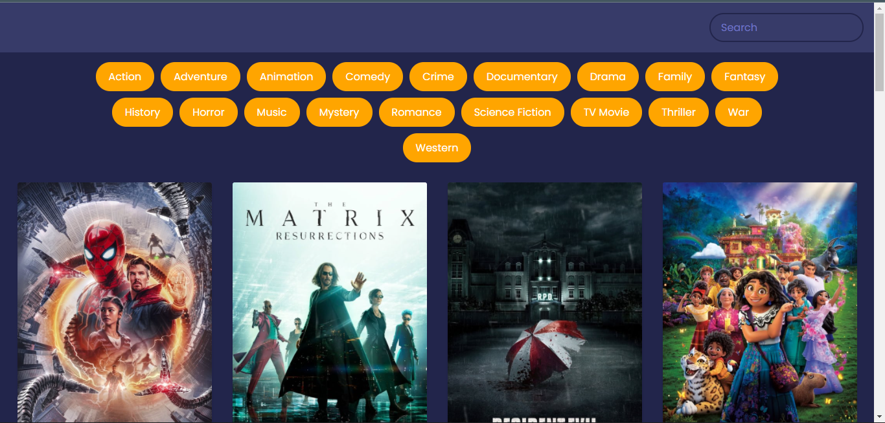
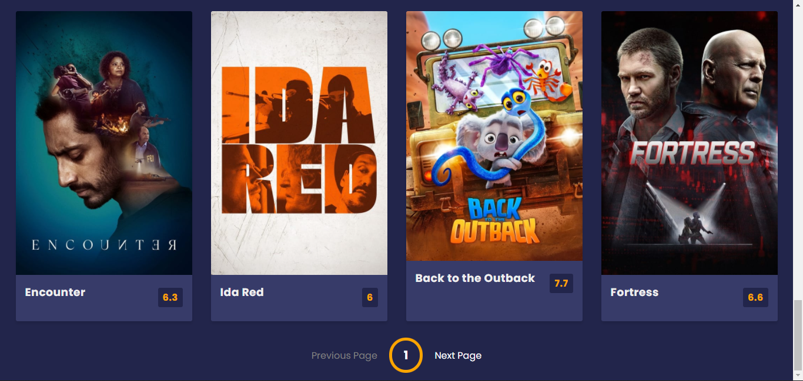

# Movie Recommendation App (PWA Version)

## About the Project

This project is an adaptation of the original "Movie Recommendation App." It has been refactored and extended to function as a **Progressive Web App (PWA)**, allowing it to be installed and used directly on mobile devices.

This app will recommend you some latest movies in different genres. Here you can also search for the movie of your choice and enjoy watching it. Jump in to see more.

**This project serves solely for learning purposes and as a demonstration of PWA implementation.**

## Original Developer & Repository

This app is based on the great work by **Khushi Purwar**.
The original repository can be found here:
[https://github.com/khushi-purwar/WebDev-ProjectKart/tree/master/23.Movie%20Recommendation%20App](https://github.com/khushi-purwar/WebDev-ProjectKart/tree/master/23.Movie%20Recommendation%20App)

## Tech Stacks Used

## Screenshots

After opening the app, UI looks like:

At the bottom of the page you can see:

## Live Demo (Original)

## Visit Original Website

[https://khushi-purwar.github.io/Web-Dev-ProjectKart/](https://khushi-purwar.github.io/Web-Dev-ProjectKart/)
